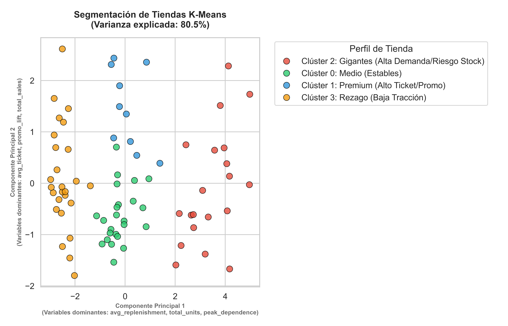

# 🛒 Super Market Data Strategy

[](https://www.python.org/)
[](https://scikit-learn.org/)
[]()

> **Rol:** Data Scientist

> **Objetivo:** Transformar datos transaccionales crudos en una estrategia de segmentación accionable para maximizar la rentabilidad y mitigar riesgos logísticos.

---

## 📖 1. Resumen Ejecutivo (El Valor del Proyecto)

El análisis profundo de más de 200,000 transacciones históricas reveló que la cadena opera bajo una filosofía táctica de **"Talla Única" (One-Size-Fits-All)**. Es decir, aplica modelos logísticos y promocionales estáticos a tiendas con comportamientos de consumo radicalmente distintos.

**Nuestra Solución:** Desarrollamos un modelo de **Machine Learning (LR + K-Means Clustering + PCA)** que clasifica a las 80 tiendas en **4 "personalidades" comportamentales**. Esto permite transicionar de estrategias genéricas a decisiones hiper-personalizadas.

---

## 🤔 2. El Planteamiento del Problema

Al iniciar la exploración de los datos (`transactions`, `stores`, `calendar`), la pregunta rectora fue: *¿Estamos optimizando el potencial de cada tienda?*

Los datos indicaron que **no**. Encontramos tres grandes fracturas en la estrategia actual:
1. **Ineficiencia Promocional:** Las promociones masivas están diluyendo el margen. A nivel macro, los días con promoción venden exactamente lo mismo que los días sin promoción.
2. **Logística Reactiva (Riesgo de Quiebre):** El sistema de reposición (`replenishment_signal`) reacciona al shock de demanda *después* de que ocurre, exponiendo a las tiendas más grandes a falta de inventario durante picos críticos.
3. **Miopía Geográfica:** Evaluar tiendas basándose únicamente en su región o formato estático (ej. `Express` vs `Bodega`) oculta su verdadero comportamiento de consumo.

---

## 🔍 3. Análisis Exploratorio (La Historia en los Datos)

Antes de modelar, realizamos un Análisis Exploratorio de Datos (EDA) y de Series de Tiempo, el cual sacó a la luz los siguientes hallazgos fundacionales:

### A. La Estacionalidad Extrema (El Efecto Buen Fin)
Al agrupar las ventas semanalmente, descubrimos que el comportamiento de consumo es plano casi todo el año, a excepción de dos disrupciones violentas:
* **El Buen Fin (13 de Noviembre):** Las ventas explotan a más de $1.33 Billones MXN en una sola semana, impulsadas masivamente por la categoría de **Electrónica**.
* **Temporada Navideña:** Un pico sostenido por Abarrotes y Bebidas.
*(Ver gráfico: `eda_3_ts_category.png`)*

### B. El Riesgo de la Señal de Reposición
Descubrimos una correlación altísima ($\rho = 0.81$) entre las unidades vendidas diarias y la alerta de reposición. Esto confirmó nuestro temor: **la cadena pide inventario basándose en el estrés transaccional del momento**, un modelo altamente riesgoso para eventos como el Buen Fin.

### C. La Disparidad Estructural
Las regiones Oriente y Occidente cargan con el mayor peso de ingresos gracias a los formatos `Bodega` y `Supercenter`, mientras que el formato `Express` presenta un rezago sistémico crónico en toda la geografía mexicana.

---

## 🧠 4. La Solución: Segmentación con Inteligencia Artificial

Para resolver el problema, aplicamos un modelo algorítmico avanzado. 

### Ingeniería de Características (Feature Engineering)
Transformamos los datos transaccionales en "rasgos de personalidad" por tienda:
* `avg_ticket`: Rentabilidad promedio.
* `promo_lift`: Sensibilidad real a las promociones.
* `peak_dependence`: Nivel de "adicción" financiera a las temporadas altas.
* `avg_replenishment`: Presión logística promedio.

### Resultados del K-Means (K=4)
Se forzó el algoritmo a encontrar 4 clústeres para mantener la viabilidad táctica de negocio. Para interpretar matemáticamente cómo la IA separó las tiendas, utilizamos **PCA (Análisis de Componentes Principales)**.




### 🎯 Los 4 Perfiles Estratégicos (Accionabilidad)

El modelo reveló los siguientes clústeres, cada uno con una estrategia de negocio recomendada:

| Clúster | Perfil Descubierto | Estrategia de Negocio Recomendada |
| :--- | :--- | :--- |
| 🔵 **Clúster 2: Los Gigantes** | Altísimo volumen de ventas y el mayor estrés logístico de la red. | **Transición a Logística Predictiva (Push).** Enviar inventario pre-calculado semanas antes del Buen Fin; abandonar la reposición reactiva para evitar roturas de stock. |
| 🟢 **Clúster 1: Los Premium** | Tiendas con el ticket promedio más alto ($343 MXN) y las únicas elásticas a promociones. | **Foco de Marketing.** Centralizar las campañas de promociones y descuentos agresivos aquí, donde sí generan incrementalidad y retorno de inversión (ROI). |
| 🔴 **Clúster 0: Medio** | Volumen estable, bajo ticket promedio, alta dependencia del Buen Fin/Navidad. | **Precios Bajos Siempre (EDLP).** Eliminar promociones temporales y enfocarse en fidelizar al cliente de volumen mediante precios estables. |
| 🟠 **Clúster 3: Rezago** | Baja tracción general, nula presión logística, sin picos estacionales. | **Reestructuración Inmobiliaria/Catálogo.** Evaluar reducción de metros cuadrados o eliminar inventario de baja rotación y sustituirlo por inventario de alta rotacion, tambien se podrian realizar campañas de marketing, ofrecer credito u otras formas de pago para incremntar ventas. |

---

##  5. Validacion de Resultados

Con base en los resultados del modelo observamos que tenemos 4 perfiles de tiendas con caracteristicas distintas entre sí, para cada una de las estrategias de negocio propuestas podemos hacer una prueba A/B (puede ser a nivel tienda o region por ejemplo) para medir el impacto real de cada estrategia, y sin afectar la operación de las tiendas al hacer pruebas localizadas pero significativas. Podemos observar los impactos en los indicadores principales de negocio KPI´s tales como:
* % variacion en venta - este indicador nos dira si tuvo un mejor performance en venta el grupo prueba vs el grupo control
* % var en ticket promedio - este indicador nos dira si tuvo un aumento o decremento en el ticket promedio en el grupo prueba vs el grupo control  
* ROI (Return over investment) - este indicador nos dira si la implementacion de alguna estrategia fue rentable en un periodo de tiempo al descontar al beneficio obtenido todos los gastos asociados a la iniciativa (gastos de nomina, desarrollo de software, marketing, etc.)
* % var en articulos con demanda agotados - este indicador nos dira si hubo una mejora en el surtido de las tiendas al tener menos articulos agotados por falta de reabastecimiento


## 🛠️ 6. Metodología Técnica (Cómo lo construimos)

Para garantizar la reproducibilidad y el rigor estadístico, se ejecutó un pipeline robusto:
1. **Recuperación de Datos (Imputación Predictiva):** Se recuperaron los valores nulos en la columna `units_sold` mediante el entrenamiento de **6 modelos de Regresión Lineal** (uno por categoría) logrando un $R^2 \approx 0.78$, preservando así la varianza estadística.
2. **Escalado:** `StandardScaler` para balancear las magnitudes de features financieros y volumétricos.
3. **Modelado:** `K-Means` para agrupamiento y `PCA` para interpretabilidad del hiperplano multidimensional.

> 📄 **Nota Técnica:** Para un desglose exhaustivo paso a paso del código, la limpieza de datos y del uso de herramientas de IA, favor de consultar el archivo [`PROCESS.md`](./PROCESS.md) incluido en este repositorio.

---

## 📂 6. Estructura del Repositorio

```text
├── data/                       # Datasets originales (.csv)
├── notebooks/                  # Jupyter Notebooks con el código fuente y experimentación
├── images/                     # Gráficos generados (EDA y Clusters PCA)
├── README.md                   # Presentación del proyecto y hallazgos de negocio (Este documento)
└── PROCESS.md                  # Documentación técnica metodológica y stack utilizado
